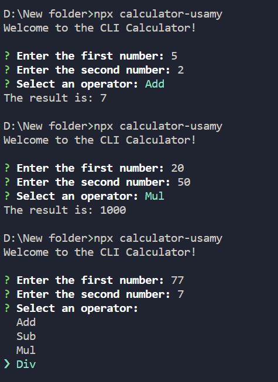

# Calculator

A simple command line calculator built with Typescript and Node.js.

## Installation

To use this calculator, you need to have Node.js and npm installed on your machine. Then, run the following command in the terminal to install the calculator:

```bash
npx calculator-usamy
```

## Technologies Used

- TypeScipt
- Node.js
- Inquirer
- chalk-animation

## Screenshots

Here are some screenshots of the calculator in action:



