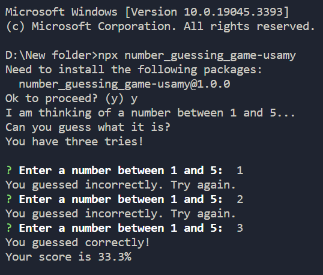
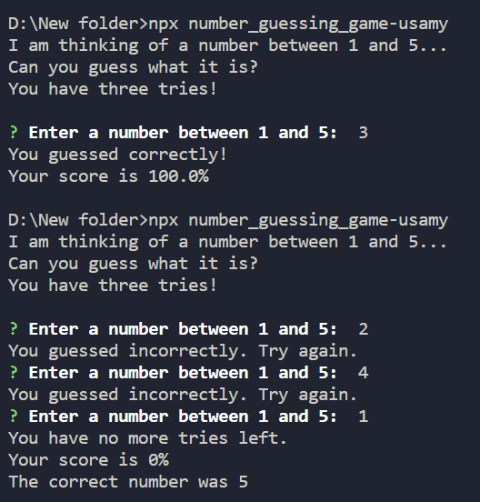

# Number Guessing Game

This guess the number game is a short TypeScript/Node.js project that allows the user to guess the number generated by the computer. There are also several ways to alter the game, like adding more rounds or displaying the score. It’s quite simple and uses the random function to generate a number.

## Installation

To use this app, you need to have Node.js and npm installed on your machine. Then, run the following command in the terminal to install the app:

```bash
npx number_guessing_game-usamy
```

## Technologies Used

- TypeScipt
- Node.js
- Inquirer

## Screenshots

Here are some screenshots of the app in action:



