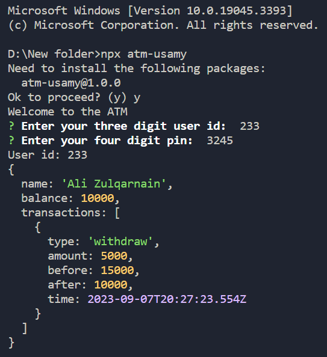
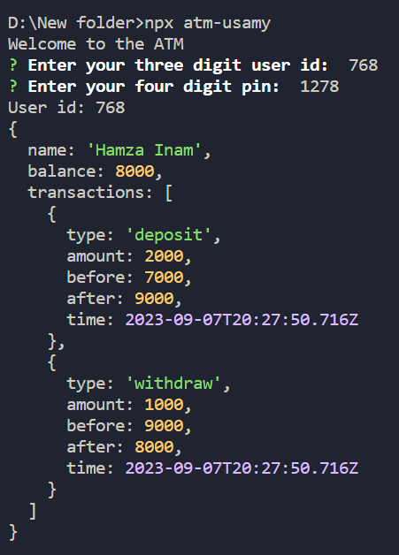
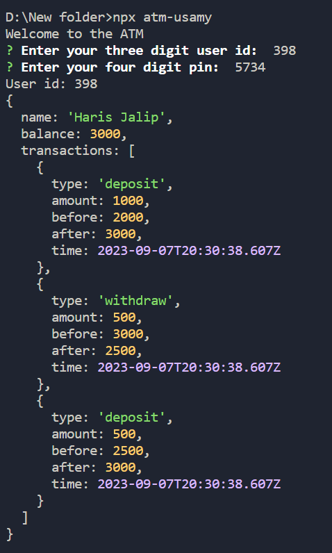

# ATM

This somewhat complex TypeScript/Node.js project is a console-based application. When the system starts the user is prompted with a user id and user pin. After entering the details successfully, the ATM functionalities are unlocked. All the user data is generated randomly.

## Installation

To use this app, you need to have Node.js and npm installed on your machine. Then, run the following command in the terminal to install the app:

```bash
npx atm-usamy
```

## Technologies Used

- TypeScipt
- Node.js
- Inquirer

## Screenshots

Here are some screenshots of the app in action:




