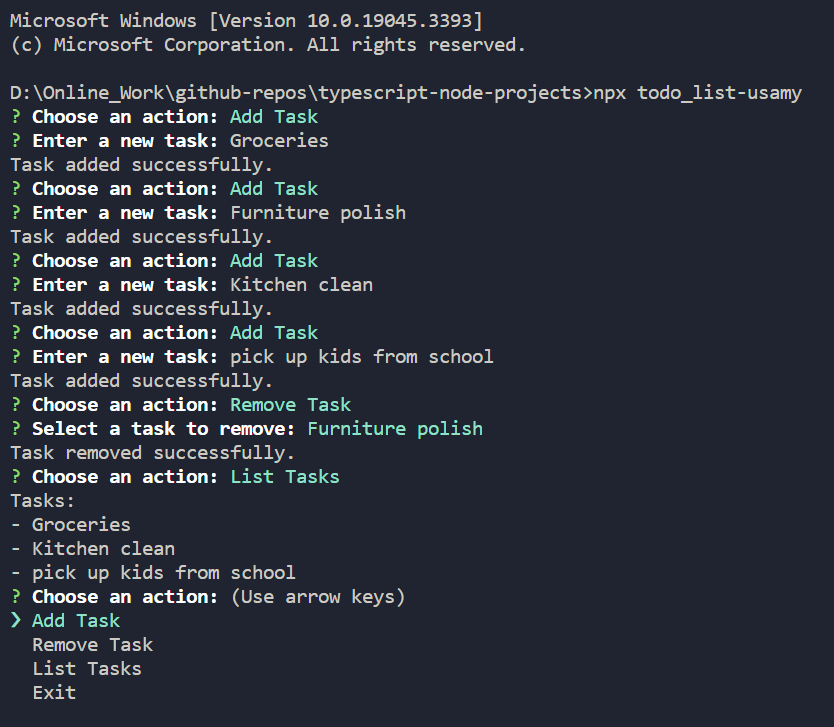

# Todo List

A simple command line Todo-list app built using TypeScipt, Node.js and Inquirer.

## Installation

To use this app, you need to have Node.js and npm installed on your machine. Then, run the following command in the terminal to install the app:

```bash
npx todo_list-usamy
```

## Technologies Used

- TypeScipt
- Node.js
- Inquirer

## Screenshots

Here are some screenshots of the app in action:


