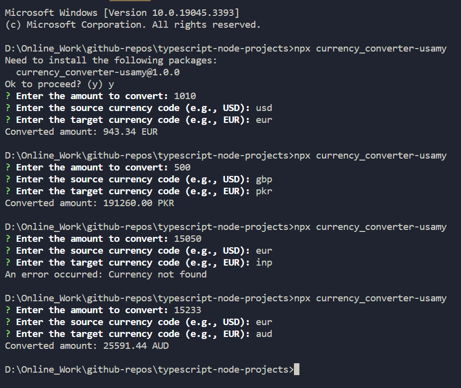

# Currency Converter

The TypeScript console app is used to convert currencies: the users enter a certain amount of money in one currency and set the currency they want to check the monetary value of.

## Installation

To use this app, you need to have Node.js and npm installed on your machine. Then, run the following command in the terminal to install the app:

```bash
npx currency_converter-usamy
```

## Technologies Used

- TypeScipt
- Node.js
- Inquirer
- Axios

## Screenshots

Here are some screenshots of the app in action:


