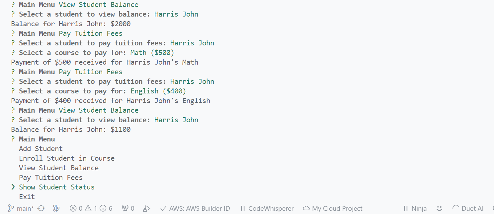

# Student Management System

This project is a simple console based Student Management System. In this project you will be learning how to add new students, how to generate a 5 digit unique studentID for each student, how to enroll students in the given courses. Also, you will be implementing the following operations enroll, view balance, pay tuition fees, show status, etc. The status will show all the details of the student including name, id, courses enrolled and balance.This is one of the best projects to implement the Object Oriented Programming concepts.

## Installation

To use this app, you need to have Node.js and npm installed on your machine. Then, run the following command in the terminal to install the app:

```bash
npx student_management_system-usamy
```

## Technologies Used

- TypeScript
- Node.js
- Inquirer

## References

[github link](https://)

[npmjs link](https://)

## Screenshots

Here are some screenshots of the app in action:





